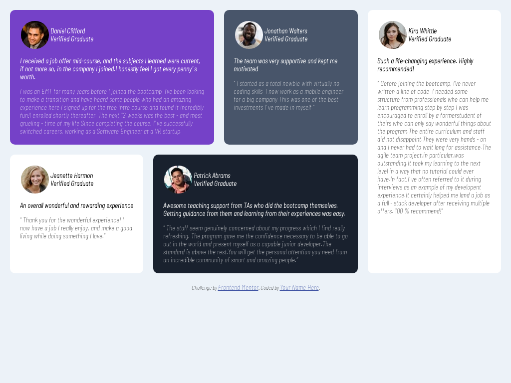

# Frontend Mentor - Testimonials grid section solution

This is a solution to the [Testimonials grid section challenge on Frontend Mentor](https://www.frontendmentor.io/challenges/testimonials-grid-section-Nnw6J7Un7). Frontend Mentor challenges help you improve your coding skills by building realistic projects. 

## Table of contents

- [Overview](#overview)
  - [The challenge](#the-challenge)
  - [Screenshot](#screenshot)
  - [Links](#links)
- [My process](#my-process)
  - [Built with](#built-with)
  - [What I learned](#what-i-learned)
  - [Useful resources](#useful-resources)
- [Author](#author)

**Note: Delete this note and update the table of contents based on what sections you keep.**

## Overview

### The challenge

Users should be able to:

- View the optimal layout for the site depending on their device's screen size

### Screenshot

### Links

- Solution URL:(https://github.com/ibtihelbs/testimonials-grid-section-main/)
- Live Site URL: (https://ibtihelbs.github.io/testimonials-grid-section-main/)

## My process

### Built with

- Semantic HTML5 markup
- CSS custom properties
- Flexbox
- CSS Grid
- Mobile-first workflow
-Json 
-Api fetch

### What I learned

CSS grid 
.container{
  display: grid;
  grid-template-areas:
     'first'
    'second'
    'third'
    'four'
    'fifth';
}
.elements{
 grid-area: first;
}

**Note: Delete this note and the content within this section and replace with your own learnings.**

### Useful resources

- [w3schools](https://www.w3schools.com/cssref/pr_grid-area.asp) helped me manage the layout
## Author

- Website - [ibtihel ben salah](https://github.com/ibtihelbs/my_portfolio)
- Frontend Mentor - [@ibtihelbs](https://www.frontendmentor.io/profile/ibtihelbs)
- linkedin - [@ibtihel-ben-salah](https://www.linkedin.com/in/ibtihel-ben-salah/)

